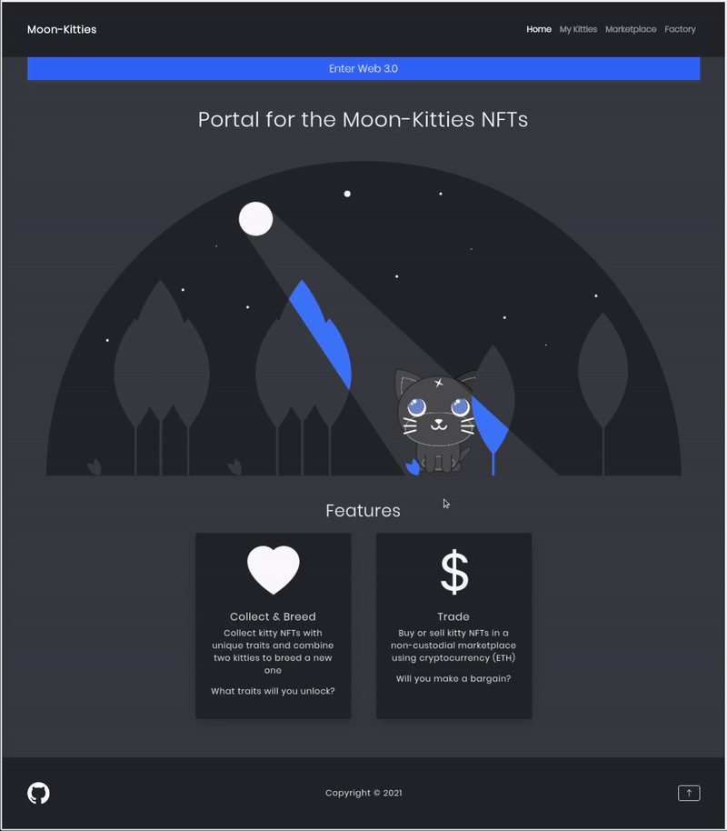
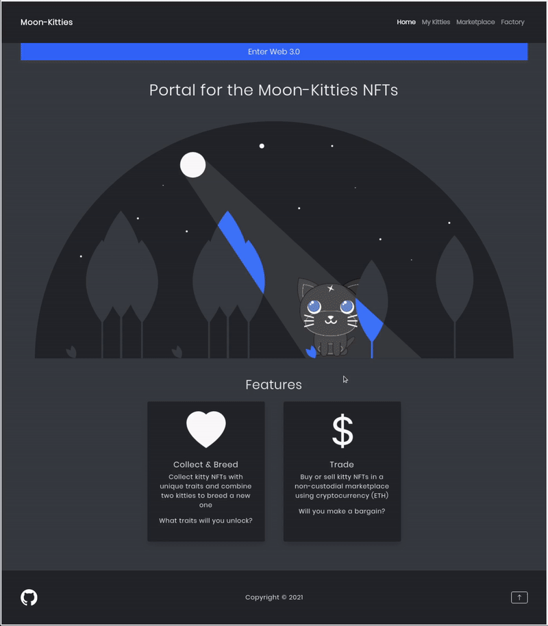

# Ethereum DApp Moon-Kitties

## About

This is a project I built while studying how to program a decentralized application (dApp) for the Ethereum blockchain. It's my own version of the well-known CryptoKitties game on Ethereum, which allows users to buy, collect, breed and sell virtual kitties living on the blockchain.

Each kitty in the dApp is an ERC721 non-fungible token (NFT) - a unique digital item controlled solely by the owner of the NFT. Users of the dApp can design and create kitty NFTs or combine two such kitties to breed a new kitty which randomly inherits traits from its parents. Users can also buy or sell these NFTs on a non-custodial marketplace using cryptocurrency (ETH).

This dApp was built using:

- Solidity 0.8
- OpenZeppelin Contracts
- Truffle
- Ganache
- Web3.js
- MetaMask

## Access DApp on the Ethereum Ropsten testnet

1. Make sure you have [MetaMask](https://metamask.io/) installed to interact with web 3.0 content in the browser

2. In MetaMask, switch the blockchain network from `Ethereum Mainnet` to `Ropsten Test Network`

3. Get some testnet ETH from an [Ethereum Ropsten faucet](https://faucet.dimensions.network/) for your Ethereum account

4. Access the dApp in the browser [here](https://derdis14.github.io/ethereum-dapp-moon-kitties/)

## Usage

### Design & Create


### Breed



### Create Sales Offer



### Buy from Marketplace


## Setup of Local Development Environment

### Set up Project and [Truffle](https://www.trufflesuite.com/truffle)

```
npm install
```

```
npm install truffle -g
```

### Set up Ganache

1. Download [Ganache](https://www.trufflesuite.com/ganache) to set up a local Ethereum blockchain

2. Start Ganache and create a new Ethereum workspace using the mnemonic phrase `mnemonicDev` found in `truffle-config.js`

3. Deploy the smart contracts of the project on Ganache using Truffle. Do so by runnning:

```
truffle migrate --network ganache --reset
```

4. The console will output the addresses of the newly deployed smart contracts. In `index.js`, replace the values of `KITTIES_CONTRACT_ADDRESS` and `KITTY_MARKETPLACE_CONTRACT_ADDRESS` accordingly.

### Set up MetaMask

1. Install [MetaMask](https://metamask.io/) to interact with the dApp in the browser

2. Add your Ganache network as a custom RPC network to MetaMask and connect to it. The RPC URL is shown in Ganache. For the Chain ID use `1337` or what MetaMask suggests.

3. Import two Ethereum accounts from Ganache to MetaMask by their private keys. The balances of these accounts should now be visible in MetaMask.

### Set up Frontend

1. Start a localhost server for the frontend of the dApp:

```
cd client
python3 -m http.server 8000
```

2. Access the dApp in the browser [here](http://localhost:8000/)
